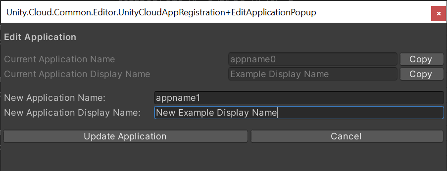
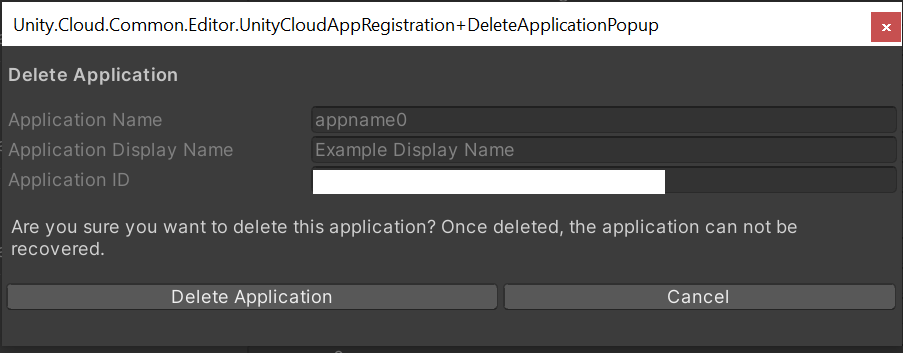

# Unity Cloud App Registration

Applications built with Unity Cloud require an application identifier when you build the application. The application identifier identifies your application in the Unity Cloud services and also enables the custom URI scheme association with the OS that's used in Unity Deep Linking and login operations.

## Before you start

To make full use of the App Registration feature in the editor, you must install the `com.unity.cloud.identity` package. For more information, see the [Identity package documentation](https://docs.unity3d.com/Packages/com.unity.cloud.identity@latest).

## Create an application identifier

To set up the application identifier manually, follow these steps:

1. Open your application project in the Unity Editor.
2. Go to **Edit > Project Settings > Unity Cloud > App Information**.
3. In the **Enter Application ID** field, enter your application identifier.
   
4. To update the application data, select **Select**.

If the `com.unity.cloud.identity` package is properly installed and you are logged in the Editor with the corresponding account, you can access existing applications.

## Select, edit, and delete an existing application

To select, edit, and delete and existing application, follow these steps:

1. Open your application project in the Unity Editor.
2. Go to **Edit > Project Settings > Unity Cloud > App Information**.
3. In the  **Organization** dropdown list, select your Organization. The list of your existing registered applications appears.
   

You can select, edit, or delete an existing application from this list:

* To select an application, select the **Select** button. This action updates the application data for the project.
* To edit an application, select the **Edit** button. This action opens a window that lets you edit the `App Name` and `App ID` values.
  
* To delete an application, select the **Delete** button. This action opens a window to confirm the deletion. Once deleted, you cannot recover the application.
  

## Register a new application

To register a new application, follow these steps:

1. Open your application project in the Unity Editor.
2. Go to **Edit > Project Settings > Unity Cloud > App Information**.
3. In the  **Organization** dropdown list, select your Organization. Below the list of registered applications, the option to register a new application appears.
   
4. In the **App Name** field, enter the desired application name.
5. In the **App Display Name** field, enter the application display name.

>[!NOTE]
>The application name must be unique, alphanumeric, in lowercase, and between 4 to 10 characters long.

6. Select the **Select** button to register the new application. When successfully registered, the local application data is updated.

Your Project is now set up.

## Customize the application namespace prefix

By default, all application have the **com.unity.cloud** namesapce prefix.

To customize the application namespace prefix, follow these steps:

1. Open your application project in the Unity Editor.
2. Go to **Edit > Project Settings > Unity Cloud > App Information**.
3. Edit the **App Namespace** input field.
